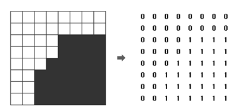
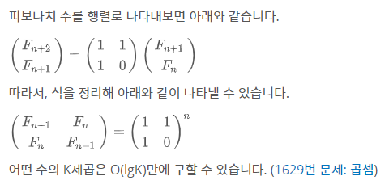

# 개념

## 분할 정복

분할정복법은 주어진 문제를 작은 사례로 나누고(Divide) 각각의 작은 문제들을 해결하여 정복 (Conquer)하는 방법이다. 출처: [코드 저장소](https://kimch3617.tistory.com/entry/알고리즘-분할정복법-Divide-and-Conquer)

분할정복법은 문제의 사례를 2개 이상의 더 작은 사례로 나눈다. 이 작은 사례는 주로 원래 문제에서 따온다. 나눈 작은 사례의 해답을 바로 얻을 수 있으면 해를 구하고 아니면 더 작은 사례로 나눈다.
해를 구할 수 있을 만큼 충분히 더 작은 사례로 나누어 해결하는 방법이다.
분할 정복법은 하향식(top-down) 접근 방법으로 최상위 사례의 해답은 아래로 내려가면서 작은 사례에 대한 해답을 구함으로써 구한다.

분할정복법의 설계전략

1. 문제 사례를 하나 이상의 작은 사례로 분할(Divide)한다.
2. 작은 사례들을 각각 정복(Conquer)한다. 작은 사례가 충분히 작지 않은 이상 재귀를 사용한다.
3. 필요하다면, 작은 사례에 대한 해답을 통합(Combine)하여 원래 사례의 해답을 구한다.


##### 분할정복법의 장단점

장점: 문제를 나눔으로써 어려운 문제를 해결할 수 있다는 엄청나게 중요한 장점이 있다. 그리고 이 방식이 그대로 사용되는 효율적인 알고리즘들도 여럿 있으며, 문제를 나누어 해결한다는 특징상 병렬적으로 문제를 해결하는 데 큰 강점이 있다. 

단점: 함수를 재귀적으로 호출한다는 점에서 함수 호출로 인한 오버헤드가 발생하며, 스택에 다양한 데이터를 보관하고 있어야 하므로 [스택 오버플로우](https://namu.wiki/w/버퍼 오버플로)가 발생하거나 과도한 메모리 사용을 하게 되는 단점


- 문제를 나눌 수 없을 때까지 나누어서 각각을 풀면서 다시 합병하여 문제의 답을 얻는 알고리즘
- 하향식 접근법으로, 상위의 해답을 구하기 위해, 아래로 내려가면서 하위의 해답을 구하는 방식
  - 일반적으로 재귀함수로 구현
- 문제를 잘게 쪼갤 때, 부분 문제는 서로 중복되지 않음
  - 예: 병합 정렬, 퀵 정렬 등


동적 계획법(Dynamic Programming)과 차이점

- 동적 계획법
  - 부분 문제는 중복되어, 상위 문제 해결 시 재활용됨
  - Memoization 기법 사용 (부분 문제의 해답을 저장해서 재활용하는 최적화 기법으로 사용)
- 분할 정복
  - 부분 문제는 서로 중복되지 않음
  - Memoization 기법 사용 안함


# 문제

## 색종이 만들기

[문제](https://www.acmicpc.net/problem/2630)

분할정복의 대표적인 문제로 재귀를 이용하여 접근한다.

문제에서 원하는 색종이 개수는 전역변수(global blue, white)를 이용한다.

### 전역변수

함수 안에서 만들어진 변수를 지역변수라고 하고, 함수 밖에서 만들어진 변수를 전역변수라고 합니다.

함수 안에서 전역변수를 만드는 방법도 있답니다. 어떤 변수를 전역변수(global)로 사용하겠다라고 명시해주는 것이죠.


```python
import sys
n = int(sys.stdin.readline())

arr = [list(map(int,sys.stdin.readline().split())) for _ in range(n)] #x행 y열
white = 0
blue  = 0

def cut(x,y,n):
    global white, blue
    check = arr[x][y]

    for i in range(x, x+n):
        for j in range(y, y+n):
            if check != arr[i][j]:
                cut(x, y, n//2)
                cut(x, y+n//2, n//2)
                cut(x+n//2, y, n//2)
                cut(x+n//2, y+n//2, n//2)
                return # for문 전체를 끝내기위해서
    
    if check == 1: # for-loop를 모두 통과했고, 색이 파랑색일 때
        blue += 1
    else:
        white += 1

cut(0,0,n)
print(white)
print(blue)
```


## 쿼드트리

[문제](https://www.acmicpc.net/problem/1992)

흑백 영상을 압축하여 표현하는 데이터 구조로 쿼드 트리(Quad Tree)라는 방법이 있다. 흰 점을 나타내는 0과 검은 점을 나타내는 1로만 이루어진 영상(2차원 배열)에서 같은 숫자의 점들이 한 곳에 많이 몰려있으면, 쿼드 트리에서는 이를 압축하여 간단히 표현할 수 있다.

주어진 영상이 모두 0으로만 되어 있으면 압축 결과는 "0"이 되고, 모두 1로만 되어 있으면 압축 결과는 "1"이 된다. 만약 0과 1이 섞여 있으면 전체를 한 번에 나타내지를 못하고, 왼쪽 위, 오른쪽 위, 왼쪽 아래, 오른쪽 아래, 이렇게 4개의 영상으로 나누어 압축하게 되며, 이 4개의 영역을 압축한 결과를 차례대로 괄호 안에 묶어서 표현한다

**중요!** : 예시 : 아래 그림에서 왼쪽의 영상은 오른쪽의 배열과 같이 숫자로 주어지며, 이 영상을 쿼드 트리 구조를 이용하여 압축하면 "(0(0011)(0(0111)01)1)"로 표현된다. 




```python
import sys
n = int(sys.stdin.readline())
image = []
for i in range(n):
    image.append(list(map(int, sys.stdin.readline().rstrip())))
    
# 바깥 루프는 y, 안쪽 루프는 x. 혼동하지 않기!!
def quadtree(x,y,n):
    check = image[y][x]
    if n==1: return check
    for j in range(y,y+n):
        for i in range(x,x+n):
            if check != image[j][i]:
                left_up = quadtree(x,y,n//2)
                right_up = quadtree(x+n//2,y,n//2)
                left_down = quadtree(x,y+n//2,n//2)
                right_down = quadtree(x+n//2,y+n//2,n//2)
                return '({}{}{}{})'.format(left_up, right_up, left_down, right_down)
    else:
        return check


print(quadtree(0,0,n))
```


## 곱셈

[문제](https://www.acmicpc.net/problem/1629)

a 의 b제곱을 c로 나눈 나머지를 구하는 문제다.

이것이 왜 분할정복인가..하면 b제곱이 너무 오래걸리기때문에 b를 빠르게 감소시키는 방법을 생각해야한다.

우선 큰 수의 계산은 복잡하므로 나머지를 구할 수 있을 때 계속 나눠준다. (% c)

b가 2의 배수면 

> a ** b % c == (a ** (b//2) % c) ** 2 % c

2의 배수가 아니면 

> a ** b % c ==  (a ** (b-1) % c) * a % c


임을 이용해준다.

```python
a,b,c = map(int, input().split())

def cal(a,b,c):
    if b==1:
        return a%c
    elif b%2==0:
        return cal(a, b//2, c) ** 2 % c
    else:
        return cal(a,b-1,c) * a % c 

print(cal(a,b,c))
```


이것보다 더 효율적(?)인 방법으로는 python 내장함수 `pow`를 쓰는 것이 있는데 pow에 대한 설명은 아래와 같다.

```python
pow(a,b) // a**b
pow(a,b,c) // a**b%c
```


## 이항계수 3

[문제](https://www.acmicpc.net/problem/11401)

nCk를 1000000007으로 나눈 나머지를 구하는 프로그램.

문제를 효율적으로 풀기 위해 [페르마의 소정리](https://m.blog.naver.com/PostView.nhn?blogId=a4gkyum&logNo=220768006509&proxyReferer=https:%2F%2Fwww.google.com%2F)를 먼저 알아보자.


조건

1. a는 정수, p는 소수
2. a는 p의 약수가 아니다. (사실상 a ≠ p)

결과

- a^p ≡ a (mod p)
- if a ≠ 0: a^(p-1) ≡ 1 (mod p) 


이를 다음과 같이 이용할 수 있다.

[출처](https://onsil-thegreenhouse.github.io/programming/problem/2018/04/02/problem_combination/)


```
a^p = a (mod p)
a^(p-1) = 1 (mod p)

a^(p-1) = 1(mod p) 이므로, mod p를 구할 때 얼마든지 곱해줄 수 있다.

---------

{A * B^(-1)} %p
= {A * B^(-1) * B^(p-1)} %p 
= {A * B^(p-2)} %p 
= {A%p * B^(p-2)} %p 
```


## 행렬의 곱셈

[문제](https://www.acmicpc.net/problem/2740)

N\*M 행렬과 M\*K 행렬의 곱셈


```python
import sys
n,m = map(int, sys.stdin.readline().split())
A = [list(map(int, sys.stdin.readline().split())) for _ in range(n)]
    

m,k = map(int, sys.stdin.readline().split())
B = [list(map(int, sys.stdin.readline().split())) for _ in range(m)]


result = [[0 for _ in range(k)] for _ in range(n)] 
for a in range(n):
    for b in range(k):
        for c in range(m):
            result[a][b] += A[a][c] * B[c][b]
        sys.stdout.write("{} ".format(result[a][b]))
    sys.stdout.write("\n")
```


## 행렬의 제곱

[문제](https://www.acmicpc.net/problem/10830)

곱셈의 응용. n제곱은 분할정복


```python
import sys
n, b = map(int, sys.stdin.readline().split())

A = [list(map(int, sys.stdin.readline().split())) for _ in range(n)]

matrix = A

def cal1(matrix): # 한번 곱하기
    result = [[0 for _ in range(n)] for _ in range(n)]
    for r in range(n): # 행
        for m in range(n): # 열
            for i in range(n):
                result[r][m] += matrix[r][i] * A[i][m] % 1000
            result[r][m] %= 1000
    return result


def cal2(matrix): # 제곱하기
    result = [[0 for _ in range(n)] for _ in range(n)]
    for r in range(n): # 행
        for m in range(n): # 열
            for i in range(n):
                result[r][m] += matrix[r][i] * matrix[i][m] % 1000
            result[r][m] %= 1000
    return result


def cal(matrix): # 전체계산
    global b
    if b==1:
        for i in range(n):
            for j in range(n):
                matrix[i][j] %= 1000 # 1000보다 작거나 같은 자연수
        return matrix
    elif b%2==0:
        b //= 2
        return cal2(cal(matrix))
    else:
        b -= 1
        return cal1(cal(matrix))
        
ans = cal(matrix)

for a in ans:
    print(*a)
```


## 행렬 곱셈을 이용한 피보나치 수

[문제](https://www.acmicpc.net/problem/2749)

[피보나치를 구하는 5가지 방법]([https://shoark7.github.io/programming/algorithm/%ED%94%BC%EB%B3%B4%EB%82%98%EC%B9%98-%EC%95%8C%EA%B3%A0%EB%A6%AC%EC%A6%98%EC%9D%84-%ED%95%B4%EA%B2%B0%ED%95%98%EB%8A%94-5%EA%B0%80%EC%A7%80-%EB%B0%A9%EB%B2%95.html](https://shoark7.github.io/programming/algorithm/피보나치-알고리즘을-해결하는-5가지-방법.html))

이번 문제에서는 행렬 제곱을 이용해 피보나치 수를 구해본다.




중간과정은 아래의 식과 같다.

```
(F_(n+2) F_(n+1)) = (1 1) (F_(n+1) F_n    )
(F_(n+1) F_n    )   (1 0) (F_n     F_(n-1))

F0 = 0, F1 = 1, F2 = 1

[[1,1],[0,1]]이 계속 곱해지는 식이 완성!
```

코드는 위 문제를 아주 조금만 변형하면 된다.